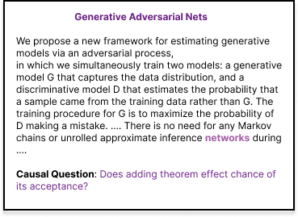

# Repo for PGM project

## Abstract
Adjusting for potential confounding in the text, such as the specific concept, topic, or writing style is challenging. In this paper, we design a method to estimate causal effects from observational text data. Since text data is very high-dimensional, one common approach is to find lower-dimensional representations or embeddings which make computations easier and at the same time preserve
vital information relevant to causal inference. For certain casual estimation tasks, we can assume an underlying causal structure that allows us to make accurate predictions and also help identify the effect of specific treatments. In this paper, we extend Veitch et al. (2019b)’s work and analyze the sufficient causal text embeddings that preserve causal information and help in the estimation of a causal effect. Using semi-synthetic datasets, we investigated how causally sufficient embeddings impact causal estimation compared to other embedding methods. The results of our study support the conclusion that causally sufficient embeddings can enhance the accuracy of causal estimation, which is consistent with the findings of previous research.




## Dependencies and setup

| Dependency | Version | Installation Command |
| ---------- | ------- | -------------------- |
| Python     | 3.8     | `conda create --name covid_entities python=3.8` and `conda activate covid_entities` |
| PyTorch, cudatoolkit    | 1.5.0, 10.1   | `conda install pytorch==1.5.0 cudatoolkit=10.1 -c pytorch` |
| Transformers (Huggingface) | 2.9.0 | `pip install transformers==2.9.0` |
| Scikit-learn | 0.23.1 | `pip install scikit-learn==0.23.1` |
| scipy        | 1.5.0  | `pip install scipy==1.5.0` |
| NLTK    | 3.5  | `pip install nltk==3.5
` |

<!--
- python 3.8
```conda create --name covid_entities python=3.8``` & ```conda activate covid_entities```
- PyTorch 1.5.0, cudatoolkit=10.1
```conda install pytorch==1.5.0 cudatoolkit=10.1 -c pytorch```
- Huggingface transformers - 2.9.0
```pip install transformers==2.9.0```
- scikit-learn 0.23.1
```pip install scikit-learn==0.23.1```
- scipy 1.5.0
```pip install scipy==1.5.0```
- ekphrasis 0.5.1
```pip install nltk==3.5```

-->

## Instruction to run the code
```
python trainer.py # use args parse to update params
```

Here are params list

`-- exp_name`: experiment  
`--data_dir`: The input training data file (a csv file)  
`--model_card`: The model card to use.  
`--batch_size`: Batch size for training.  
`--learning_rate`: The initial learning rate for Adam.  
`--num_train_epochs`: "Total number of training epochs to perform."   
`--output_dir`: The output directory where the model predictions and checkpoints will be written.  
`--Q_weigth`: Weigthing of Q term in loss  

`--g_weight`: Weigthing of g term in loss  

`--mlm_weight`: Weigthing of g term in loss  
                    